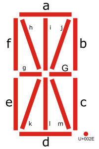

# Zero-width Element 14-seg font

Some 14-segment characters can have several variants. For example, B can have two variants:

Zero-width Element 14-seg font is a tool to design, review, and discuss about 14-segment character variants.
It contains 16 glyphs and U+0020 space. Of these, 15 correspond to each segment. See below:

U+002E is full stop, namely "period." 

The 15 glyphs have zero-width, so you can combine them. You should place U+0020 space among each characters.

BTW the remaining one is U+007E tilde (~). It contains all 15 elements and have width.

You can type copy-and-paste Zero-width Element 14-seg font below:

Please try to copy-and-paste in the text input area above. It 
